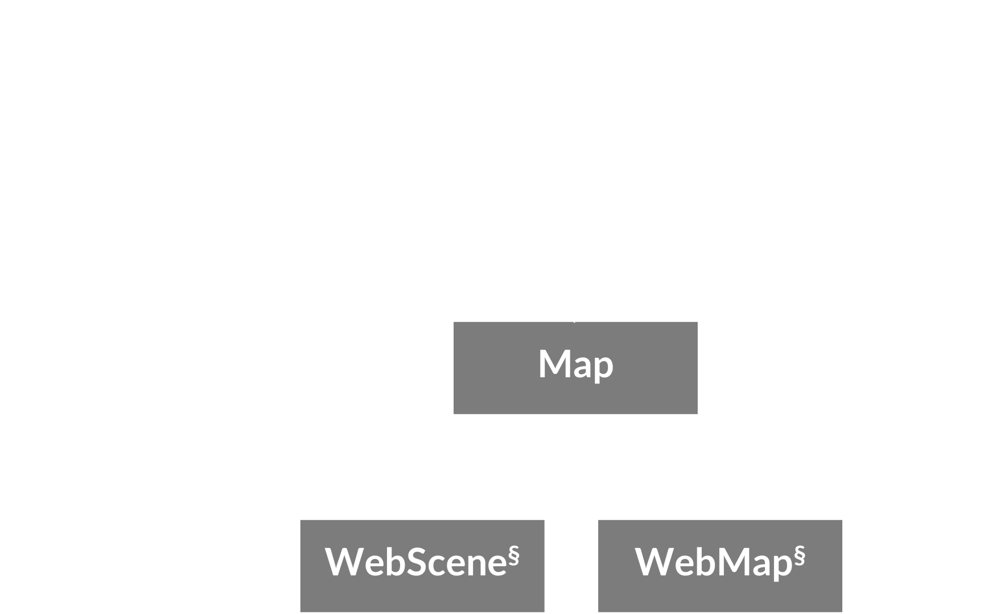

<!-- .slide: data-background="images/bg-1.png" -->

### ArcGIS API for JavaScript
 
#### Interactive 3D Maps: Beyond the Basics

<br/>

<p style="font-size: smaller">Johannes Schmid, ESRI R&amp;D Center Z&uuml;rich</p>
<p style="font-size: smaller">Stefan Eilemann, ESRI R&amp;D Center Z&uuml;rich</p>

<br/>

<p><small>
Live version of this presentation is available on:<br>https://arcgis.github.io/devsummit-2019-3D-jsapi/presentations/3d-maps-with-the-arcgis-js-api-beyond-the-basics
</small></p>

---

<!-- .slide: data-background="images/bg-2.png" -->

## Agenda

1. API Architecture
2. Camera and Navigation
3. Interacting with Data
4. Filtering
5. Symbology
6. Interactive Widgets
7. Performance and Quality
8. 3D Models

---

<!-- .slide: data-background="images/bg-4.png" -->

## API Architecture

---

## API Architecture
### _Simple sample_

```javascript
require([
  "esri/Map",
  "esri/views/SceneView",
  "esri/views/FeatureLayer"
], function(Map, SceneView) {
  
  var map = new Map({
    basemap: "satellite"
  });
  
  var view = new SceneView({
    container: "viewDiv",
    map: map
  });
  
  var layer = new FeatureLayer({
    url: "http://..."
  });
  
  map.add(layer);
  
});
```

---

## API Architecture

<br/>


---

## API Architecture



---

<!-- .slide: data-background="images/bg-3.png" -->

### JavaScript API
#### _2D vs 3D_

- Unified data model: [`Map`](https://developers.arcgis.com/javascript/latest/api-reference/esri-Map.html)
  - [`Layer`](https://developers.arcgis.com/javascript/latest/api-reference/esri-layers-Layer.html) &mdash; Fundamental Map component
  - [`Renderer`](https://developers.arcgis.com/javascript/latest/api-reference/esri-renderers-Renderer.html) &mdash; Visualization Methods
  - [`Symbol`](https://developers.arcgis.com/javascript/latest/api-reference/esri-symbols-Symbol.html) &mdash; Symbolization Instructions
- Separate views
  - [`MapView`](https://developers.arcgis.com/javascript/latest/api-reference/esri-views-MapView.html) &mdash; 2D Visualization
  - [`SceneView`](https://developers.arcgis.com/javascript/latest/api-reference/esri-views-SceneView.html) &mdash; 3D Visualization
- Easy to transition: switch between `MapView` and `SceneView`

---


<!-- .slide: data-background="images/bg-2.png" -->

### JavaScript API
#### _2D &amp; 3D Viewing_

<div class="twos">
  <div class="snippet">
  <pre><code class="lang-js hljs javascript">
var map = new Map({
  basemap: "streets-vector",

  layers: [new FeatureLayer(
    "...Germany/FeatureServer/0"
  )]
});

viewLeft = new MapView({
  container: "viewDivLeft",

  map: map
});

viewRight = new SceneView({
  container: "viewDivRight",
  map: map
});

</code></pre>
  </div>
  <div class="snippet-preview">
    <iframe id="frame-2d-3d-parallel" data-src="./snippets/setup-2d-3d-parallel.html"></iframe>
  </div>
</div>


---


<!-- .slide: data-background="images/bg-2.png" -->

### JavaScript API
#### _Promises_

- Asynchronous operations return a `Promise`
- Example: [`geometryService.project()`](https://developers.arcgis.com/javascript/latest/api-reference/esri-tasks-GeometryService.html#project)
- `Promise` provides result and error callbacks

```js
var promise = geometryService.project(parameters);

promise
    .then((result) => {
      // process result
      view.graphics.add(new Graphic({
        geometry: result[0],
        symbol: ...
      }));
    })
    .catch((error) => {
      // handle error
      displayErrorMessage(error);
    });
```  

---

<!-- .slide: data-background="images/bg-2.png" -->

### JavaScript API
#### _Promises_

- `Promise` is chainable and allows writing sequential asynchronous code
- Certain API classes behave like `Promise`, but using `when()`
  - [`SceneView`](https://developers.arcgis.com/javascript/latest/api-reference/esri-views-SceneView.html), [`MapView`](https://developers.arcgis.com/javascript/latest/api-reference/esri-views-MapView.html), [`Layer`](https://developers.arcgis.com/javascript/latest/api-reference/esri-layers-Layer.html)


```js
view
    .when(() => {
      // View is ready to be interacted with, load the layer
      return layer.load();
    })

    .then(() => {
      // Layer is now loaded, project extent using geometry service
      return geometryService.project([layer.fullExtent]);
    })

    .then((projected) => {
      // Extent has been projected, we can now go to it
      return view.goTo(projected[0]);
    })

    .then(() => {
      // Here the goTo animation has finished
    });
```

---

### whenLayerView
- also https://jscore.esri.com/javascript/latest/api-reference/esri-views-SceneView.html#allLayerViews

---


<!-- .slide: data-background="images/bg-4.png" -->

## ArcGIS API for JavaScript
### _Camera and Navigation_

---


<!-- .slide: data-background="images/bg-2.png" -->

### SceneView
#### _The 3D View_

- The [`SceneView`](https://developers.arcgis.com/javascript/latest/api-reference/esri-views-SceneView.html) provides 3D specific functionality


```ts
class SceneView {
  // Camera specifies the view
  camera: Camera;

  // Programmatic navigation
  goTo(...);

  // Settings that affect constraints (e.g. navigation constraints)
  constraints: SceneViewConstraints;

  // Padding on the view
  padding: { top: number, right: number, bottom: number, left: number };

  // Quality profile
  qualityProfile: string;

  // Converting coordinate systems
  toScreen(mapPoint: Point): ScreenPoint;
  toMap(screenPoint: ScreenPoint): Point;
}
```

---


<!-- .slide: data-background="images/bg-2.png" -->


### SceneView
#### _Camera Definition_

- 3D viewing parameters in a [`SceneView`](https://developers.arcgis.com/javascript/latest/api-reference/esri-views-SceneView.html) are controlled by [`esri/Camera`](https://developers.arcgis.com/javascript/latest/api-reference/esri-Camera.html)

```ts
class Camera {
  // The position of the camera eye in 3D space (`x`, `y` + `z` elevation)
  position: Point;

  // The heading angle (towards north in degrees, [0, 360]°)
  heading: number;

  // The tilt angle ([0, 180]°, with 0° straight down, 90° horizontal)
  tilt: number;
}
```

---


<!-- .slide: data-background="images/bg-2.png" -->

### SceneView
#### _Camera Interaction_

- Changing [`SceneView.camera`](https://developers.arcgis.com/javascript/latest/api-reference/esri-views-SceneView.html#camera) immediately updates the 3D view

<div class="twos">
  <div class="snippet">
  <pre><code class="lang-js hljs javascript">// Get a copy of the current camera
var camera = view.camera.clone();

// Increment the heading of the camera by 5 degrees
camera.heading += 5;

// Set the modified camera on the view
view.camera = camera;</code></pre>
  <svg data-play-frame="frame-camera-heading-increment" class="play-code" viewBox="0 0 24 24"><path fill="#999" d="M12,20.14C7.59,20.14 4,16.55 4,12.14C4,7.73 7.59,4.14 12,4.14C16.41,4.14 20,7.73 20,12.14C20,16.55 16.41,20.14 12,20.14M12,2.14A10,10 0 0,0 2,12.14A10,10 0 0,0 12,22.14A10,10 0 0,0 22,12.14C22,6.61 17.5,2.14 12,2.14M10,16.64L16,12.14L10,7.64V16.64Z" /></svg>
  </div>
  <div class="snippet-preview">
    <iframe id="frame-camera-heading-increment" data-src="./snippets/setup-camera-heading-increment.html"></iframe>
  </div>
</div>

---


<!-- .slide: data-background="images/bg-3.png" -->

### SceneView
#### _View Navigation_

- Use [`SceneView.goTo(target, options)`](https://developers.arcgis.com/javascript/latest/api-reference/esri-views-SceneView.html#goTo) to navigate
 - Supports different targets:<br/> `Camera`, `Geometry`, `Geometry[]`, `Graphic`, `Graphic[]`
 - Supports specifying desired `scale`, `position`, `heading` and `tilt`
 - Allows specifying animation options:<br/> `animate`, `speedFactor` or `duration`, `easing`
 - Returns a `Promise` which resolves when the animation has finished

---

<!-- .slide: data-background="images/bg-2.png" -->

### SceneView
#### _View Navigation &num;1_

- Use [`SceneView.goTo()`](https://developers.arcgis.com/javascript/latest/api-reference/esri-views-SceneView.html#goTo) to create smooth camera animations

<div class="twos">
  <div class="snippet">
  <pre><code class="lang-js hljs javascript">
// compute new heading:
// current heading + 30 degrees
var heading = view.camera.heading + 30;

// go to w/ heading only preserves view.center
view.goTo({
  heading: heading
});
</code></pre>
  <svg data-play-frame="frame-goto-heading" class="play-code" viewBox="0 0 24 24"><path fill="#999" d="M12,20.14C7.59,20.14 4,16.55 4,12.14C4,7.73 7.59,4.14 12,4.14C16.41,4.14 20,7.73 20,12.14C20,16.55 16.41,20.14 12,20.14M12,2.14A10,10 0 0,0 2,12.14A10,10 0 0,0 12,22.14A10,10 0 0,0 22,12.14C22,6.61 17.5,2.14 12,2.14M10,16.64L16,12.14L10,7.64V16.64Z" /></svg>
  </div>
  <div class="snippet-preview">
    <iframe id="frame-goto-heading" data-src="./snippets/setup-goto-heading.html"></iframe>
  </div>
</div>

---


<!-- .slide: data-background="images/bg-2.png" -->

### SceneView
#### _View Navigation &num;2_

- Use [`SceneView.goTo()`](https://developers.arcgis.com/javascript/latest/api-reference/esri-views-SceneView.html#goTo) to frame a set of graphics

<div class="twos">
  <div class="snippet">
  <pre><code class="lang-js hljs javascript">// createGraphics() returns an array of Graphic
const graphics = createGraphics();
  
view.goTo({

  // The target is a set of graphics which should be
  // brought into view
  target: graphics

  // Additionally, define the scale, heading and tilt
  // of the desired view
  scale: 5000,
  heading: 30,
  tilt: 70
});
</code></pre>
  <svg data-play-frame="frame-goto-graphics" class="play-code" viewBox="0 0 24 24"><path fill="#999" d="M12,20.14C7.59,20.14 4,16.55 4,12.14C4,7.73 7.59,4.14 12,4.14C16.41,4.14 20,7.73 20,12.14C20,16.55 16.41,20.14 12,20.14M12,2.14A10,10 0 0,0 2,12.14A10,10 0 0,0 12,22.14A10,10 0 0,0 22,12.14C22,6.61 17.5,2.14 12,2.14M10,16.64L16,12.14L10,7.64V16.64Z" /></svg>
  </div>
  <div class="snippet-preview">
    <iframe id="frame-goto-graphics" data-src="./snippets/setup-goto-graphics.html"></iframe>
  </div>
</div>

---


<!-- .slide: data-background="images/bg-2.png" -->

### SceneView
#### _View Navigation &num;3_

- Use [`SceneView.goTo(..., options)`](https://developers.arcgis.com/javascript/latest/api-reference/esri-views-SceneView.html#goTo) to control the animation

<div class="twos">
  <div class="snippet">
  <pre><code class="lang-js hljs javascript">
// double the animation speed
view.goTo(target, {
  speedFactor: 2
});


// animate for exactly 1 second
view.goTo(target, {
  duration: 1000
});


// disable ease-in and ease-out
view.goTo(target, {
  easing: "linear"
});
</code></pre>
  <svg data-play-frame="frame-goto-options" class="play-code" viewBox="0 0 24 24"><path fill="#999" d="M12,20.14C7.59,20.14 4,16.55 4,12.14C4,7.73 7.59,4.14 12,4.14C16.41,4.14 20,7.73 20,12.14C20,16.55 16.41,20.14 12,20.14M12,2.14A10,10 0 0,0 2,12.14A10,10 0 0,0 12,22.14A10,10 0 0,0 22,12.14C22,6.61 17.5,2.14 12,2.14M10,16.64L16,12.14L10,7.64V16.64Z" /></svg>
  </div>
  <div class="snippet-preview">
    <iframe id="frame-goto-options" data-src="./snippets/setup-goto-options.html"></iframe>
  </div>
</div>

---


<!-- .slide: data-background="images/bg-2.png" -->

### SceneView
#### _View Constraints_

- Use [`SceneView.constraints`](https://developers.arcgis.com/javascript/latest/api-reference/esri-views-SceneView.html#constraints) to control navigation and rendering aspects

<div class="twos">
  <div class="snippet">
  <pre><code class="lang-js hljs javascript">
// Set the allowed altitude range of the viewer
view.constraints.altitude = {
  max: 100000000, // 100'000 km
  min: 10000000   // 10'000 km
};


// Set the clip distance (near/far planes)
// to override the default clipping heuristics
view.constraints.clipDistance = {
  far: 200000000, // 200'000 km
  near: 200000    // 200 km
};

</code></pre>
  <svg data-play-frame="frame-constraints" class="play-code" viewBox="0 0 24 24"><path fill="#999" d="M12,20.14C7.59,20.14 4,16.55 4,12.14C4,7.73 7.59,4.14 12,4.14C16.41,4.14 20,7.73 20,12.14C20,16.55 16.41,20.14 12,20.14M12,2.14A10,10 0 0,0 2,12.14A10,10 0 0,0 12,22.14A10,10 0 0,0 22,12.14C22,6.61 17.5,2.14 12,2.14M10,16.64L16,12.14L10,7.64V16.64Z" /></svg>
  </div>
  <div class="snippet-preview">
    <iframe id="frame-constraints" data-src="./snippets/setup-constraints.html"></iframe>
  </div>
</div>

<p style="text-align: center; font-size: 0.5em">Original satellite app: https://github.com/richiecarmichael/Esri-Satellite-Map</span>
</p>

---


<!-- .slide: data-background="images/bg-2.png" -->

### SceneView
#### _View Padding_

- Use [`SceneView.padding`](https://developers.arcgis.com/javascript/latest/api-reference/esri-views-SceneView.html#constraints) to focus view on a rectangle

<div class="twos">
  <div class="snippet">
  <pre><code class="lang-js hljs javascript">// Set the padding to make
// space for a sidebar and a header
view.padding = {
  top: 50,
  left: 150
};
</code></pre>
  <svg data-play-frame="frame-padding" class="play-code" viewBox="0 0 24 24"><path fill="#999" d="M12,20.14C7.59,20.14 4,16.55 4,12.14C4,7.73 7.59,4.14 12,4.14C16.41,4.14 20,7.73 20,12.14C20,16.55 16.41,20.14 12,20.14M12,2.14A10,10 0 0,0 2,12.14A10,10 0 0,0 12,22.14A10,10 0 0,0 22,12.14C22,6.61 17.5,2.14 12,2.14M10,16.64L16,12.14L10,7.64V16.64Z" /></svg>
  </div>
  <div class="snippet-preview">
    <iframe id="frame-padding" data-src="./snippets/setup-padding.html"></iframe>
  </div>
</div>

---


<!-- .slide: data-background="images/bg-4.png" -->

## ArcGIS API for JavaScript
### _Interacting with Data_

---

<!-- .slide: data-background="images/bg-2.png" -->

### Mouse Interaction
#### _View.toMap_

- `toMap` translates screen (mouse) point to map coordinates

<div class="twos">
  <div class="snippet">
  <pre><code class="lang-js hljs javascript">document.getElementById("viewDiv").onclick =
function (event) {
  event.stopPropagation();

  // get mouse position in map coordinates
  var point = view.toMap(event);
  polygon = addPointToPolygon(point);
  view.graphics.push(polygon); // add to view
}
</code></pre>
  <svg data-play-frame="frame-tomap-graphics" class="play-code" viewBox="0 0 24 24"><path fill="#999" d="M12,20.14C7.59,20.14 4,16.55 4,12.14C4,7.73 7.59,4.14 12,4.14C16.41,4.14 20,7.73 20,12.14C20,16.55 16.41,20.14 12,20.14M12,2.14A10,10 0 0,0 2,12.14A10,10 0 0,0 12,22.14A10,10 0 0,0 22,12.14C22,6.61 17.5,2.14 12,2.14M10,16.64L16,12.14L10,7.64V16.64Z" /></svg>
  </div>
  <div class="snippet-preview">
    <iframe id="frame-tomap-graphics" data-src="./snippets/tomap-graphics.html"></iframe>
  </div>
</div>

---

<!-- .slide: data-background="images/bg-2.png" -->

### Mouse Interaction
#### _View.hitTest_

- `hitTest` intersects scene and delivers hit objects

<div class="twos">
  <div class="snippet">
  <pre><code class="lang-js hljs javascript">document.getElementById("viewDiv").onclick = function (event) {
  event.stopPropagation();

  view.hitTest({x: event.clientX, y: event.clientY})
  .then(function (response) {
    // check only front-most hit
    var result = response.results[0];
    // Use it if it is a graphic
    if (result && result.graphic) {
      var point = result.graphic.geometry;
      polygon = addPointToPolygon(point);
      view.graphics.push(polygon); // add to view
    }
  }
}
</code></pre>
  <svg data-play-frame="frame-hittest-graphics" class="play-code" viewBox="0 0 24 24"><path fill="#999" d="M12,20.14C7.59,20.14 4,16.55 4,12.14C4,7.73 7.59,4.14 12,4.14C16.41,4.14 20,7.73 20,12.14C20,16.55 16.41,20.14 12,20.14M12,2.14A10,10 0 0,0 2,12.14A10,10 0 0,0 12,22.14A10,10 0 0,0 22,12.14C22,6.61 17.5,2.14 12,2.14M10,16.64L16,12.14L10,7.64V16.64Z" /></svg>
  </div>
  <div class="snippet-preview">
    <iframe id="frame-hittest-graphics" data-src="./snippets/hittest-graphics.html"></iframe>
  </div>
</div>


---

<!-- .slide: data-background="images/bg-2.png" -->

### Mouse Interaction
#### _View.hitTest_

- 4.11: `hitTest` delivers multiple hits

<div class="twos">
  <div class="snippet">
  <pre><code class="lang-js hljs javascript">view.hitTest({...})
.then(function (response) {
  for (result of response.results){
    layer.graphics.push(new Graphic({... result.mapPoint});
  }

  var line = new Polyline({
    paths:[first point, last point], 
  });

  layer.graphics.push(new Graphic({... line});
}
</code></pre>
  </div>
  <div class="snippet-preview">
    <iframe id="frame-hittest-graphics" data-src="./snippets/hittest-scene.html"></iframe>
  </div>
</div>


---


<!-- .slide: data-background="images/bg-2.png" -->

### Mouse Interaction
#### _SketchViewModel_

- High-Level Widget for drawing

<div class="twos">
  <div class="snippet">
  <pre><code class="lang-js hljs javascript">var graphicsLayer = new GraphicsLayer();
var map = new Map({
  layers: [graphicsLayer]
}),

view.when(function () {
  var svm = new SketchViewModel({
    layer: graphicsLayer,
    view: view
  });
  svm.create("polygon");
});
</code></pre>
  <svg data-play-frame="frame-svm-graphics" class="play-code" viewBox="0 0 24 24"><path fill="#999" d="M12,20.14C7.59,20.14 4,16.55 4,12.14C4,7.73 7.59,4.14 12,4.14C16.41,4.14 20,7.73 20,12.14C20,16.55 16.41,20.14 12,20.14M12,2.14A10,10 0 0,0 2,12.14A10,10 0 0,0 12,22.14A10,10 0 0,0 22,12.14C22,6.61 17.5,2.14 12,2.14M10,16.64L16,12.14L10,7.64V16.64Z" /></svg>
  </div>
  <div class="snippet-preview">
    <iframe id="frame-svm-graphics" data-src="./snippets/svm-graphics.html"></iframe>
  </div>
</div>


---

<!-- .slide: data-background="images/bg-4.png" -->

## ArcGIS API for JavaScript
### _Filtering_

- Model - View
- Layer - LayerView
- Layer filters are generally server side
- LayerView filters are client side

---

<!-- .slide: data-background="images/bg-5.png" -->

### Server-Side Filtering
#### _DefinitionExpression_

- Applied when fetching data

<div class="twos">
  <div class="snippet">
  <pre><code class="lang-js hljs javascript">var layer = new FeatureLayer(...);
layer.definitionExpression = "health = 'good'"

var view = new SceneView({
  container: containers.viewDiv,

  map: new Map({
    basemap: "streets",
    ground: "world-elevation",
    layers: [layer]
  }),
});
</code></pre>
  <svg data-play-frame="frame-def-graphics" class="play-code" viewBox="0 0 24 24"><path fill="#999" d="M12,20.14C7.59,20.14 4,16.55 4,12.14C4,7.73 7.59,4.14 12,4.14C16.41,4.14 20,7.73 20,12.14C20,16.55 16.41,20.14 12,20.14M12,2.14A10,10 0 0,0 2,12.14A10,10 0 0,0 12,22.14A10,10 0 0,0 22,12.14C22,6.61 17.5,2.14 12,2.14M10,16.64L16,12.14L10,7.64V16.64Z" /></svg>
  </div>
  <div class="snippet-preview">
    <iframe id="frame-def-graphics" data-src="./snippets/def-graphics.html"></iframe>
  </div>
</div>

---

<!-- .slide: data-background="images/bg-5.png" -->

### Client-Side Filtering
#### _Spatial Filter_

- FeatureFilter on FeatureLayerView and SceneLayerView
  
<div class="twos">
  <div class="snippet">
  <pre><code class="lang-js hljs javascript">view.when(function () {
  var svm = new SketchViewModel({
    layer: graphicsLayer,
    view: view
  });
  svm.create("polygon");

  graphicsLayer.graphics.on("change", () => {
    const graphic = graphicsLayer.graphics.getItemAt(0);
    layerView.filter = new FeatureFilter({
      geometry: graphic.geometry.clone(),
      spatialRelationship: "intersects"
    });
  });
});
</code></pre>
  <svg data-play-frame="frame-filter-graphics" class="play-code" viewBox="0 0 24 24"><path fill="#999" d="M12,20.14C7.59,20.14 4,16.55 4,12.14C4,7.73 7.59,4.14 12,4.14C16.41,4.14 20,7.73 20,12.14C20,16.55 16.41,20.14 12,20.14M12,2.14A10,10 0 0,0 2,12.14A10,10 0 0,0 12,22.14A10,10 0 0,0 22,12.14C22,6.61 17.5,2.14 12,2.14M10,16.64L16,12.14L10,7.64V16.64Z" /></svg>
  </div>
  <div class="snippet-preview">
    <iframe id="frame-filter-graphics" data-src="./snippets/filter-graphics.html"></iframe>
  </div>
</div>


---

<!-- .slide: data-background="images/bg-6.png" -->

## ArcGIS API for JavaScript
### _Symbology_

---

<!-- .slide: data-background="images/bg-5.png" -->

### Symbology
#### _Inside - Outside_

- Set up two areas for different Styles

<div class="twos">
  <div class="snippet">
  <pre><code class="lang-js hljs javascript">
var map = new Map({
  layers: [inside, outside, graphicsLayer]
}),

var mask = new Polygon({...});
var graphic = new Graphic({
  geometry: mask,
  symbol: fill
});
graphicsLayer.graphics.push(graphic);

view.whenLayerView(inside).then(function (lv) {
  lv.filter = new FeatureFilter({
    geometry: mask,
    spatialRelationship: "intersects"
  });
});

view.whenLayerView(outside).then(function (lv) {
  lv.filter = new FeatureFilter({
    geometry: mask,
    spatialRelationship: "disjoint"
  });
});
</code></pre>
  <svg data-play-frame="frame-filter-inout" class="play-code" viewBox="0 0 24 24"><path fill="#999" d="M12,20.14C7.59,20.14 4,16.55 4,12.14C4,7.73 7.59,4.14 12,4.14C16.41,4.14 20,7.73 20,12.14C20,16.55 16.41,20.14 12,20.14M12,2.14A10,10 0 0,0 2,12.14A10,10 0 0,0 12,22.14A10,10 0 0,0 22,12.14C22,6.61 17.5,2.14 12,2.14M10,16.64L16,12.14L10,7.64V16.64Z" /></svg>
  </div>
  <div class="snippet-preview">
    <iframe id="frame-filter-inout" data-src="./snippets/inout-graphics.html"></iframe>
  </div>
</div>

---

<!-- .slide: data-background="images/bg-6.png" -->

### Symbology
#### _Outside_

<div class="twos">
  <div class="snippet">
  <pre><code class="lang-js hljs javascript">var outside = new FeatureLayer(...);
outside.screenSizePerspectiveEnabled = true;
outside.featureReduction = {
  type: "selection"
};

outside.renderer = new SimpleRenderer({
  symbol: new PointSymbol3D({
    symbolLayers: [new IconSymbol3DLayer({
      resource: {
        href: "..."
      },
      size: 12,
      material: {
        color: "darkgreen"
      }
    })],
    verticalOffset: {
      screenLength: 6
    },
  })
});)
</code></pre>
  <svg data-play-frame="frame-filter-outside" class="play-code" viewBox="0 0 24 24"><path fill="#999" d="M12,20.14C7.59,20.14 4,16.55 4,12.14C4,7.73 7.59,4.14 12,4.14C16.41,4.14 20,7.73 20,12.14C20,16.55 16.41,20.14 12,20.14M12,2.14A10,10 0 0,0 2,12.14A10,10 0 0,0 12,22.14A10,10 0 0,0 22,12.14C22,6.61 17.5,2.14 12,2.14M10,16.64L16,12.14L10,7.64V16.64Z" /></svg>
  </div>
  <div class="snippet-preview">
    <iframe id="frame-filter-outside" data-src="./snippets/outside-graphics.html"></iframe>
  </div>
</div>

---

<!-- .slide: data-background="images/bg-6.png" -->

### Symbology
#### _Inside_

<div class="twos">
  <div class="snippet">
  <pre><code class="lang-js hljs javascript">inside.renderer = new UniqueValueRenderer({
  field: "spc_common",
  defaultSymbol: new WebStyleSymbol({
    name: "Alnus",
    styleName: "EsriThematicTreesStyle"
  })
});

var trees = [
  ["black locust", "Robinia"],
  ...
  ["London planetree", "Platanus"]

];
for (var i = 0; i < trees.length; ++i) {
  var id = trees[i][0];
  var name = trees[i][1];
  inside.renderer.addUniqueValueInfo(id, new WebStyleSymbol({
    name: name,
    styleName: "EsriRealisticTreesStyle"
  }));
}
</code></pre>
  <svg data-play-frame="frame-filter-inside" class="play-code" viewBox="0 0 24 24"><path fill="#999" d="M12,20.14C7.59,20.14 4,16.55 4,12.14C4,7.73 7.59,4.14 12,4.14C16.41,4.14 20,7.73 20,12.14C20,16.55 16.41,20.14 12,20.14M12,2.14A10,10 0 0,0 2,12.14A10,10 0 0,0 12,22.14A10,10 0 0,0 22,12.14C22,6.61 17.5,2.14 12,2.14M10,16.64L16,12.14L10,7.64V16.64Z" /></svg>
  </div>
  <div class="snippet-preview">
    <iframe id="frame-filter-inside" data-src="./snippets/inside-graphics.html"></iframe>
  </div>
</div>

---

<!-- .slide: data-background="images/bg-4.png" -->

## ArcGIS API for JavaScript
### _Performance and Quality_

---

<!-- .slide: data-background="images/bg-2.png" -->

### View Quality

- Use [`qualityProfile`](https://developers.arcgis.com/javascript/latest/api-reference/esri-views-SceneView.html#constraints) and [`quality`](https://developers.arcgis.com/javascript/latest/api-reference/esri-views-SceneView.html#constraints) to control performance and quality
- Affects: Level of detail for map and scene layer, anti-aliasing, atmosphere, memory used

<div class="twos">
  <div class="snippet">
  <pre><code class="lang-js hljs javascript" style="padding: 0 24px 0 24px">
viewLeft = new SceneView({
  qualityProfile: "low",

  environment: {
    atmosphere: { quality: "low" },
    lighting: {
      directShadowsEnabled: false,
      ambientOcclusionEnabled: false
    }
  }
});

viewRight = new SceneView({
  qualityProfile: "high"

  environment: {
    atmosphere: { quality: "high" }
    lighting: {
      directShadowsEnabled: true,
      ambientOcclusionEnabled: true
    }
  }
});
</code></pre>
  <svg data-play-frame="frame-quality-profile" class="play-code" viewBox="0 0 24 24"><path fill="#999" d="M12,20.14C7.59,20.14 4,16.55 4,12.14C4,7.73 7.59,4.14 12,4.14C16.41,4.14 20,7.73 20,12.14C20,16.55 16.41,20.14 12,20.14M12,2.14A10,10 0 0,0 2,12.14A10,10 0 0,0 12,22.14A10,10 0 0,0 22,12.14C22,6.61 17.5,2.14 12,2.14M10,16.64L16,12.14L10,7.64V16.64Z" /></svg>
  </div>
  <div class="snippet-preview">
    <iframe id="frame-quality-profile" data-src="./snippets/setup-quality-profile.html"></iframe>
  </div>
</div>


---

<!-- .slide: data-background="images/bg-2.png" -->

### Memory and Quality

- Reduce number of layers
  - In particular Map Tile Layers
  - Combine Data into a single Layer
- Textured SceneLayers use more than non-textured
- Edges
- Graphics
- API will reduce quality under Memory Pressure

---

<!-- .slide: data-background="images/bg-2.png" -->

### Memory and Quality

<div class="twos">
  <div class="snippet">
  <pre><code class="lang-js hljs javascript">view.map.basemap = "topo";

treeLayerView.maximumNumberOfFeatures = 10000;

buildings.renderer = {
  ..no edges.. 
};
</code></pre>
  <svg data-play-frame="frame-memory" class="play-code" viewBox="0 0 24 24"><path fill="#999" d="M12,20.14C7.59,20.14 4,16.55 4,12.14C4,7.73 7.59,4.14 12,4.14C16.41,4.14 20,7.73 20,12.14C20,16.55 16.41,20.14 12,20.14M12,2.14A10,10 0 0,0 2,12.14A10,10 0 0,0 12,22.14A10,10 0 0,0 22,12.14C22,6.61 17.5,2.14 12,2.14M10,16.64L16,12.14L10,7.64V16.64Z" /></svg>
  </div>
  <div class="snippet-preview">
    <iframe id="frame-memory" data-src="./snippets/memory.html"></iframe>
  </div>
</div>

---

<!-- .slide: data-background="images/bg-2.png" -->

### Data Preparation

- Publish in Scene SpatialReference to avoid reprojection
- In ArcGIS Online Layer Item Settings:
  - Tick the checkbox for Optimize Layer Drawings
  - Rebuild Spatial Index
  - Set the Cache Control to 1 hour

---

<!-- .slide: data-background="images/bg-2.png" -->

## External renderer

- You have data that you cannot visualize with available renderers, methods
- You want visualizations/animations that are not (yet) available
- You are familiar with WebGL and can afford the development effort
- Advanced WebGL in 3D Scene Views with the ArcGIS API for JavaScript (5563 / 10005) 

---

<!-- .slide: data-background="images/bg-esri.png" -->
