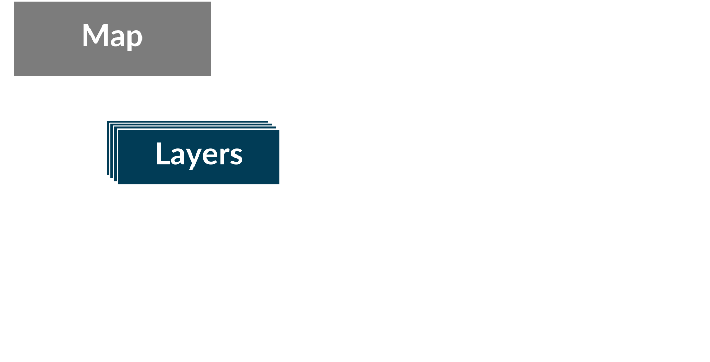

<!-- .slide: data-background="images/bg-1.png" -->

## Interactive 3D Maps with the<br/> ArcGIS API for JavaScript

#### Getting Started

<br />

<p>Johannes Schmid, Esri R&amp;D Center Z&uuml;rich</p>
<p>Arno Fiva, Esri R&amp;D Center Z&uuml;rich</p>

---

<!-- .slide: data-background="images/bg-4.png" -->

## Fancy example

<i>This is what you will learn to do</i>

---

<!-- .slide: data-background="images/bg-4.png" -->

## Simple stuff

Out of the box functionality (one page per topic)
<ul>
  <li>Create <code>Map</code></li>
  <li>Make it 3D with <code>SceneView</code>, local vs global</li>
  <li>Different baselayers/terains</li>
  <li>Theory: Map/MapView/SceneView</li>
  <li>Widgets, e.g. search</li>
</ul>

---

<!-- .slide: data-background="images/bg-3.png" -->

### The simplest possible app

```html
<!DOCTYPE html>
<html>
<head>
  <meta charset="utf-8">
  <title>Create a 3D map</title>  
  
  <link rel="stylesheet" href="//js.arcgis.com/4.10/esri/css/main.css">
  <script src="//js.arcgis.com/4.10/"></script>  
  
</head>
<body>
  <script>
      require([
        "esri/Map",
        "esri/views/SceneView",
        "dojo/domReady!"
      ], function(Map, SceneView) {
        
        var map = new Map({
          basemap: "satellite"
        });
        
        var view = new SceneView({
          container: "viewDiv",
          map: map
        });        
      });
  </script>
  <div id="viewDiv"></div> 
</body>
</html>
```

<span style="font-size: 50%">https://developers.arcgis.com/javascript/latest/sample-code/sandbox/index.html?sample=intro-sceneview</span>

---

<!-- .slide: data-background="images/bg-3.png" -->

### Architecture

<br/>


---

<!-- .slide: data-background="images/bg-3.png" -->

### Changing a map from 2D to 3D

- [`Map`](https://developers.arcgis.com/javascript/latest/api-reference/esri-Map.html) is universal
- [`MapView`](https://developers.arcgis.com/javascript/latest/api-reference/esri-MapView.html) creates a 2D map
- [`SceneView`](https://developers.arcgis.com/javascript/latest/api-reference/esri-SceneView.html) creates a 3D map

<span style="font-size: 50%">https://developers.arcgis.com/javascript/latest/sample-code/sandbox/index.html?sample=layers-vectortilelayer</span>
---

<!-- .slide: data-background="images/bg-4.png" -->

## Resources

<ul>
  <li>Developer portal (SDK)</li>
  <li>Sandbox</li>
  <li>GitHub</li>
  <li>Pricing?</li>
</ul>

---

<!-- .slide: data-background="images/bg-4.png" -->

## Add data to your map

---

<!-- .slide: data-background="images/bg-3.png" -->

### Add data to your map

- Add a `TileLayer`
  - https://services.arcgisonline.co.nz/arcgis/rest/services/Imagery/newzealand/MapServer
  - Discuss adding as op layer vs basemap?  
- Add buildings (3D object scene layer, not BSL)
  - Data sources: living atlas, portal item, URL
- Add point features
  - FeatureLayer and/or GeoJSON/CSV?
- Overview of layer/data types

---

<!-- .slide: data-background="images/bg-3.png" -->

### Visualizing data

- Theoretical background on Renderers/Symbols
- Change building style
  - Textures on/off
  - Edges
- Change point style
  - From primitive to web style icon
  - Callouts, maybe perspective
  - Add tree layer + 3D models from web styles?
- elevationInfo? 

---

<!-- .slide: data-background="images/bg-3.png" -->

### Interact with data

- Introduce BSL
- Interacting with BSL: hitTest -> hide layer
- goTo 

---

<!-- .slide: data-background="images/bg-4.png" -->

## Finish

* Other sessions
* Survey
